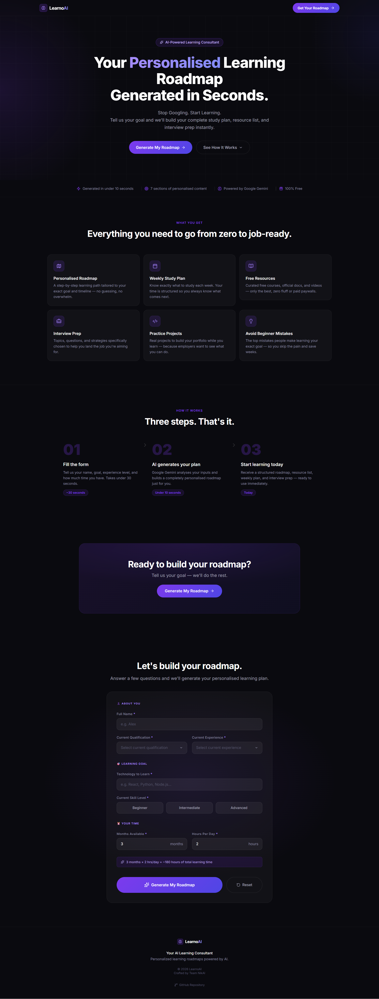
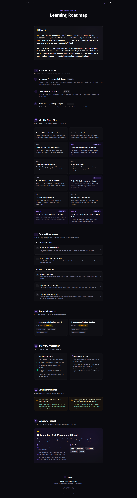

# 🚀 LearnoAI

<div align="center">

### 🤖 AI-Powered Personalized Learning Consultant

Generate a personalized learning roadmap in seconds using AI.

### 🌐 Live Demo

👉 **https://learno-ai-five.vercel.app/**

</div>

---

## 📖 Overview

LearnoAI is an AI-powered learning consultant that generates structured, personalized learning roadmaps tailored to each learner's goals, experience, current skill level, and available study time.

Instead of searching through countless tutorials, blogs, and videos, users receive a complete learning plan in seconds—including roadmap phases, weekly study schedules, curated resources, interview preparation, beginner guidance, practice projects, and a capstone project recommendation.

Powered by **Google Gemini**, every roadmap is generated dynamically based on the learner's profile. No production roadmap content is hardcoded.

---

# ✨ Features

- 🤖 AI-generated personalized learning roadmap
- 📅 Structured weekly study plan
- 📚 Curated official documentation & free learning resources
- 🛠 Practice project recommendations
- 💼 Interview preparation guidance
- 🎯 Capstone project suggestions
- ⚠️ Beginner mistakes & best practices
- 🔍 Smart technology validation & autocomplete
- 🌙 Modern responsive dark UI
- 🔒 Secure server-side Gemini integration
- 🚀 Production deployment on Vercel

---

# 📸 Screenshots

## 🏠 Landing Page



---

## 🤖 AI Generated Learning Roadmap



---

# 🧠 AI Architecture

```text
                 User Form
                      │
                      ▼
          Next.js Client Component
                      │
                      ▼
      Next.js Route Handler (Server)
                      │
                      ▼
          Google Gemini API
                      │
                      ▼
      Structured JSON Response
                      │
                      ▼
     Resource URL Enrichment Layer
                      │
                      ▼
       Personalized Roadmap Report
```

The frontend collects the learner profile and securely sends it to the backend API.

The server:

- Builds a structured AI prompt
- Sends the request to Google Gemini
- Receives structured roadmap JSON
- Maps trusted learning resources
- Returns a production-ready roadmap

The Gemini API key is never exposed to the browser.

---

# 📚 Why Resource Catalog?

Large Language Models can hallucinate URLs.

To guarantee trusted learning resources, LearnoAI uses a curated resource catalog.

Instead of generating URLs directly, Gemini selects **resource IDs**, which are mapped to verified resources stored in:

```text
src/data/resourceCatalog.js
```

This guarantees:

- ✅ Trusted documentation
- ✅ Working links
- ✅ No hallucinated URLs

while still allowing AI to generate the roadmap itself.

---

# 🛠 Tech Stack

### Frontend

- Next.js (App Router)
- React
- JavaScript (ES6+)
- Tailwind CSS v4
- Lucide React

### Backend

- Next.js Route Handlers
- Google Gemini API (`@google/genai`)

### Deployment

- Vercel

---

# 📂 Project Structure

```text
src
│
├── app
│   ├── api
│   │   └── generate-roadmap
│   ├── roadmap
│   ├── layout.js
│   └── page.js
│
├── components
│
└── data
    └── resourceCatalog.js
```

---

# ⚙️ Getting Started

Clone the repository:

```bash
git clone https://github.com/nikhil-barve1/learno-ai.git
```

Navigate into the project:

```bash
cd learno-ai
```

Install dependencies:

```bash
npm install
```

---

# 🔑 Environment Variables

Create a local environment file:

```text
.env.local
```

Add your Gemini API key:

```env
GEMINI_API_KEY=your_gemini_api_key
```

> **Important**
>
> Do **not** prefix the key with `NEXT_PUBLIC_`.
> The Gemini API key must remain server-side only.

---

# ▶️ Running Locally

Start the development server:

```bash
npm run dev
```

Open your browser:

```text
http://localhost:3000
```

---

# 🚀 Deployment

The production application is deployed on **Vercel** using secure server-side environment variables.

Before deploying:

```bash
npm run lint
npm run build
```

Configure the following environment variable in Vercel:

```text
GEMINI_API_KEY
```

---

# 🔄 How AI Generation Works

1. User submits the learning profile.
2. The frontend sends the data to `/api/generate-roadmap`.
3. The backend constructs a structured prompt.
4. Google Gemini generates a personalized roadmap.
5. The backend validates and enriches the response with trusted learning resources.
6. The frontend renders the complete roadmap report.

Every roadmap is generated dynamically based on the user's inputs.

---

# 🎯 Future Improvements

- 👤 User authentication
- 💾 Save roadmap history
- 📈 Progress tracking dashboard
- 📄 PDF roadmap export
- 📅 Calendar & reminder integration
- 🤖 AI learning mentor/chat assistant
- 🌎 Multi-language support
- 👥 Community roadmap sharing
